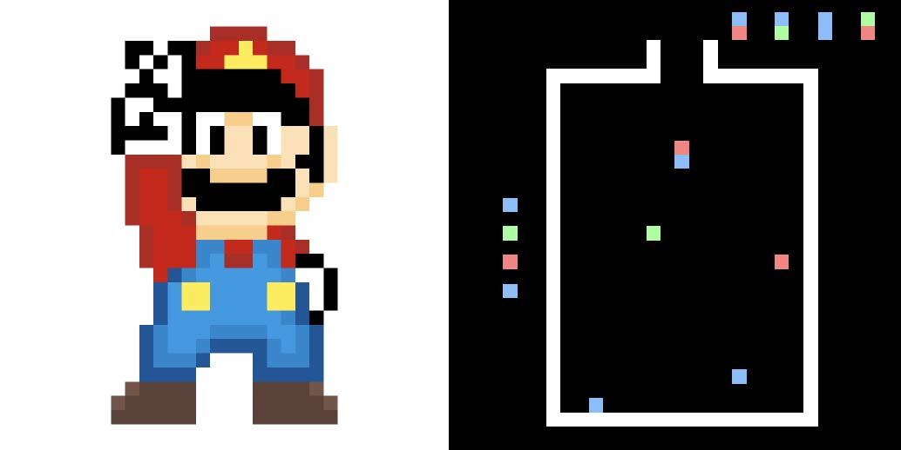
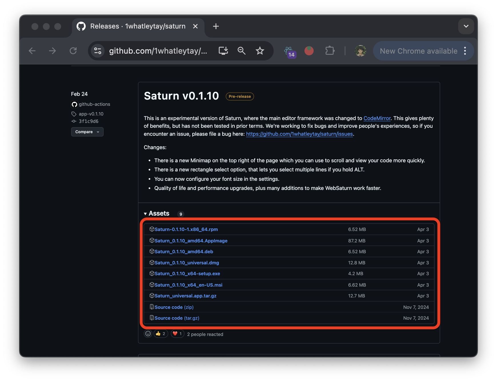
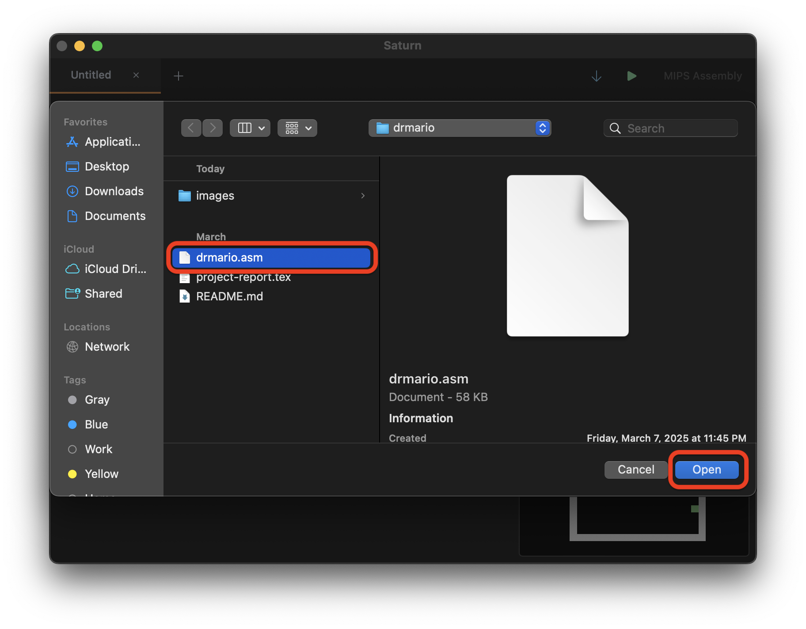
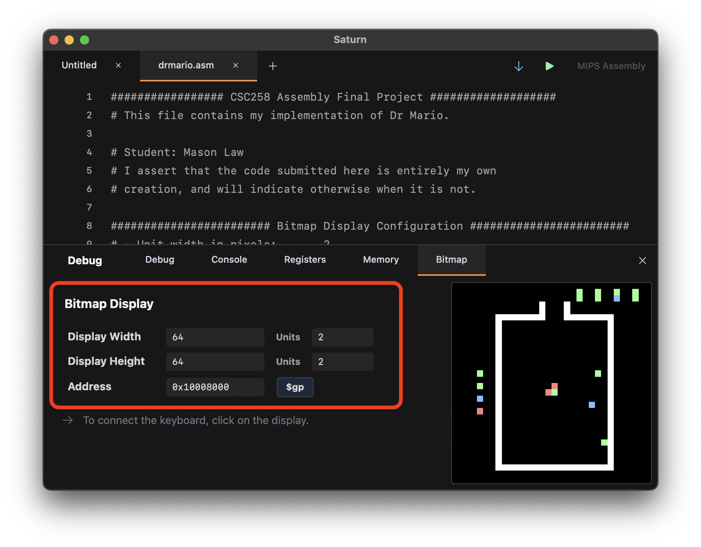
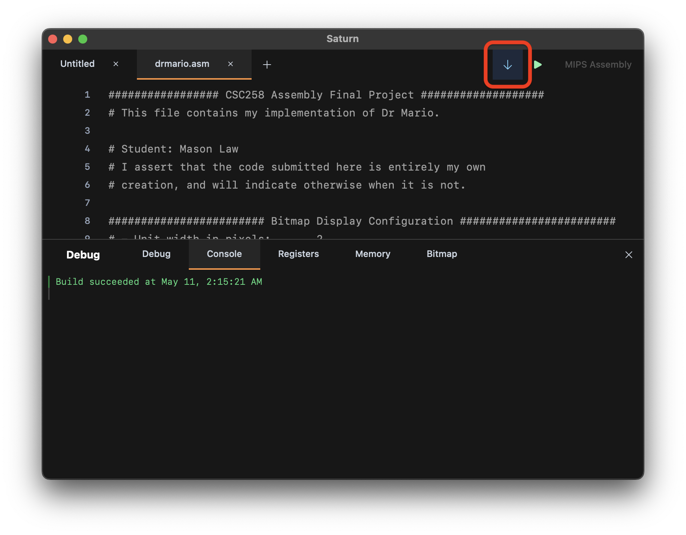
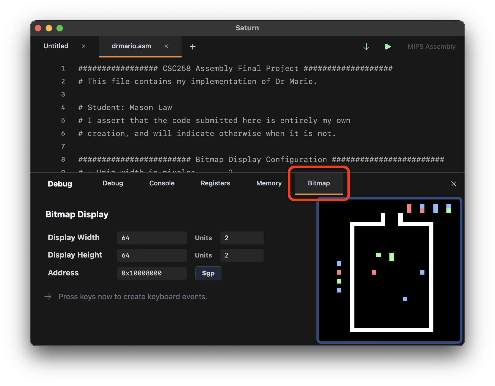
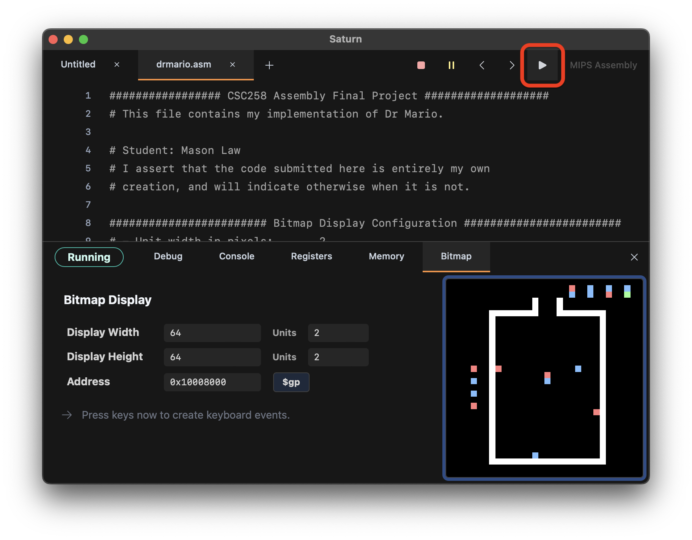

<div align="center">
    <picture>
      <source media="(prefers-color-scheme: light)" srcset="images/md-medical-info-light.svg">
      <source media="(prefers-color-scheme: dark)" srcset="images/md-medical-info-dark.svg">
      
    </picture>
</div>

<p align="center">
    A fully functional re-creation of <a href="https://en.wikipedia.org/wiki/Dr._Mario">Nintendo’s Dr. Mario</a> in Assembly
</p>

<p align="center">
    
    
</p>

---

## Game Overview
Dr. Mario is a color-matching puzzle game where your goal is to **eliminate all viruses** in a medicine bottle using falling capsules.

<p align="center"></p>

### Objective
- Clear all viruses from the bottle to win.
- Viruses are stationary and appear in red, green, or blue.

### Capsule Mechanics
- Capsules consist of **two connected halves**, each with a color (red, green, or blue).
- Capsules fall from the top and can be:
    - **Moved left/right/down**
    - **Rotated clockwise**

### Matching & Clearing
- When **four or more pieces of the same color** align **horizontally or vertically**, they disappear.
- **Row matches are checked first**, then column matches.
- After clearing:
    - Any **unsupported capsule pieces fall**.
    - If new matches form, they are cleared automatically.

### Winning
- Once all viruses are eliminated:
    - A **victory trumpet** plays 🎺
    - You can **play again or quit** using the appropriate keys below

## Controls:
<div align="center">
    <table>
    <thead>
        <tr>
        <th>Key</th>
        <th>Action</th>
        </tr>
    </thead>
    <tbody>
        <tr>
        <td><code>w</code></td>
        <td>Rotate 90° clockwise</td>
        </tr>
        <tr>
        <td><code>a</code></td>
        <td>Move capsule left</td>
        </tr>
        <tr>
        <td><code>s</code></td>
        <td>Move capsule down (faster)</td>
        </tr>
        <tr>
        <td><code>d</code></td>
        <td>Move capsule right</td>
        </tr>
        <tr>
        <td><code>p</code></td>
        <td>Pause / Unpause</td>
        </tr>
        <tr>
        <td><code>q</code></td>
        <td>Quit</td>
        </tr>
    </tbody>
    </table>
</div>

## Setup:
1. Clone this repository:
```
git clone https://github.com/justmaso/drmario.git
cd drmario
```

2. Install [`Saturn (MIPS Assembler)`](https://github.com/1whatleytay/saturn) for your specific OS:
<p align="center"></p>

3. Open `drmario.asm` in [`Saturn`](https://github.com/1whatleytay/saturn):
<p align="center"></p>

4. Open the console and configure the bitmap display as follows:
<p align="center"></p>

5. Build `drmario.asm`:
<p align="center"></p>

6. Switch to the bitmap display screen:
<p align="center"></p>

7. Run the build:
<p align="center"></p>

**NOTE:** For a better experience, use the keyboard shortcuts for `RUN` and `STOP` in Saturn. This way, you can keep your cursor focused on the bitmap display without having to unfocus it.
